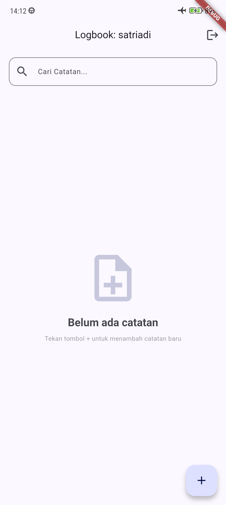
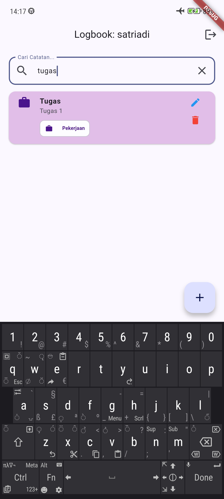
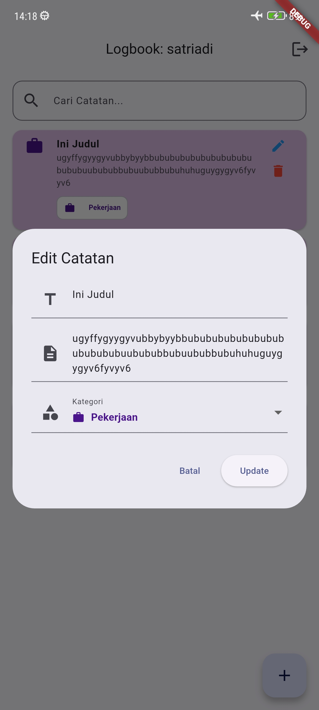

# Logbook App - Modul 3

Aplikasi Logbook Digital dengan fitur CRUD (Create, Read, Update, Delete) dan penyimpanan data permanen, dikembangkan menggunakan Flutter dengan penerapan prinsip SOLID (SRP, LSP, DIP).

## Fitur Utama

- **Onboarding**: Antarmuka pengenalan aplikasi dengan 3 langkah dan visual indikator halaman.
- **Authentication**: Sistem login multi-user dengan validasi input, toggle password visibility, dan mekanisme lockout setelah 3x gagal login.
- **Logbook CRUD**: Pencatatan aktivitas dengan fitur Tambah, Edit, dan Hapus menggunakan `ListView.builder` untuk rendering dinamis yang efisien.
- **Reactive Programming**: Manajemen state menggunakan `ValueNotifier` dan `ValueListenableBuilder` sehingga UI terupdate otomatis tanpa `setState()` manual.
- **JSON Persistence**: Seluruh data catatan disimpan secara permanen ke `Shared Preferences` dalam format JSON menggunakan serialisasi `toMap()`/`fromMap()`.
- **Search**: Pencarian catatan secara real-time berdasarkan judul.
- **Kategori**: Sistem kategori (Pribadi, Pekerjaan, Urgent) dengan warna kartu yang berbeda untuk setiap kategori.
- **Empty State**: Tampilan ilustratif ketika daftar catatan masih kosong.
- **Swipe to Delete**: Penghapusan catatan dengan gesture swipe ke kiri.

## Screenshots

|                      Empty State                       |                      Create Log                       |                     List Log                      |
| :----------------------------------------------------: | :---------------------------------------------------: | :-----------------------------------------------: |
|  |  |  |
|                     **Search Log**                     |                    **Update Log**                     |                                                   |
|   |  |                                                   |

## Lesson Learned (Refleksi Akhir)

1. **Konsep Baru**:
   - Memahami perbedaan mendasar antara pemrograman imperatif (`setState`) dan reaktif (`ValueNotifier` + `ValueListenableBuilder`). Dengan pendekatan reaktif, UI hanya merender ulang bagian yang berubah, bukan seluruh halaman, sehingga jauh lebih efisien.
   - Baru paham bahwa ValueNotifier hanya mendeteksi perubahan jika referensi objeknya berubah. Jadi harus reassign list baru dengan spread operator, bukan sekadar .add() ke list yang sama.
2. **Kemenangan Kecil**:
   - Berhasil mengimplementasikan serialisasi JSON (`jsonEncode`/`jsonDecode`) untuk menyimpan dan memuat kembali `List<LogModel>` dari `Shared Preferences`. Data catatan tetap utuh meskipun aplikasi di-restart.
   - Berhasil implementasi fitur search real-time yang bekerja di atas filteredLogs tanpa merusak data asli di logsNotifier. Awalnya sempat kehilangan data karena langsung memodifikasi logsNotifier saat search, tapi setelah mencoba memahami penggunaan 2 notifier, semuanya berjalan lancar.
3. **Target Berikutnya**:
   - Ingin eksplorasi penggunaan ChangeNotifier atau state management yang lebih advanced seperti Provider, agar pengelolaan state bisa lebih terstruktur ketika fitur aplikasi semakin banyak.
