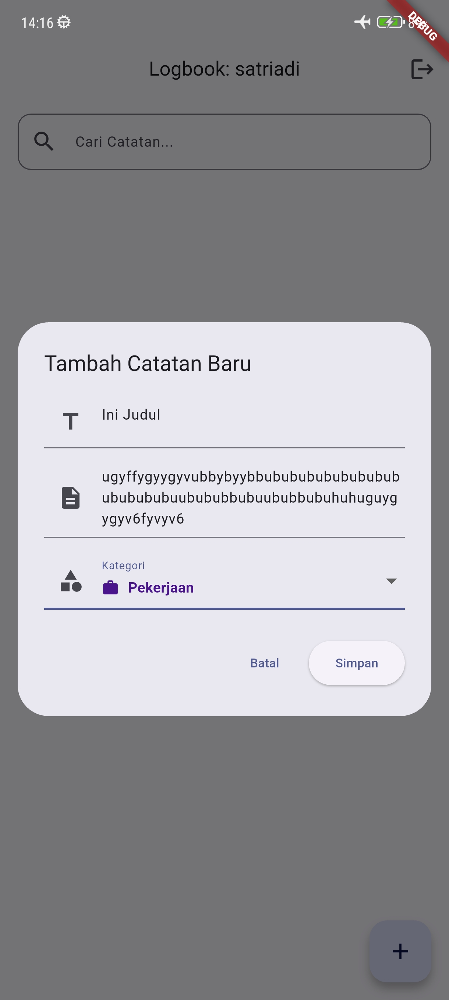
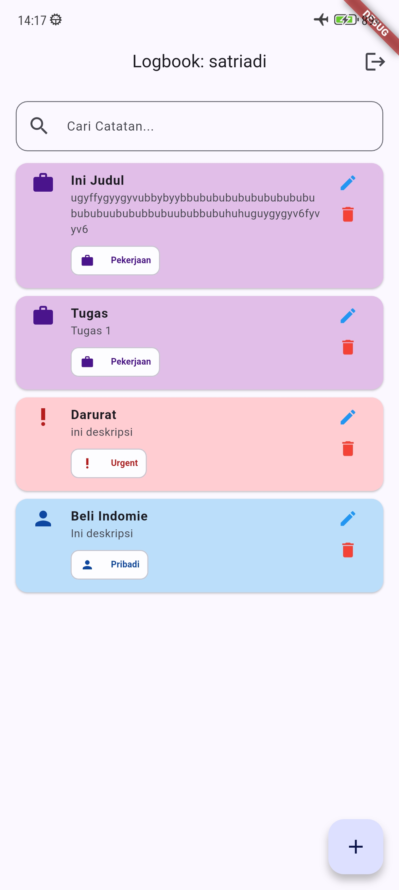

# Logbook App - Modul 4

Aplikasi Logbook Digital dengan fitur CRUD berbasis Cloud (MongoDB Atlas), dikembangkan menggunakan Flutter dengan penerapan prinsip SOLID, Singleton Pattern, dan Asynchronous Programming.

## Fitur Utama

- **Onboarding**: Antarmuka pengenalan aplikasi dengan 3 langkah dan visual indikator halaman.
- **Authentication**: Sistem login multi-user dengan validasi input, toggle password visibility, dan mekanisme lockout setelah 3x gagal login.
- **Cloud CRUD**: Pencatatan aktivitas dengan fitur Tambah, Edit, dan Hapus yang tersinkronisasi langsung ke MongoDB Atlas.
- **Reactive Programming**: Manajemen state menggunakan `ValueNotifier` dan `ValueListenableBuilder` sehingga UI terupdate otomatis.
- **Async-Reactive Flow**: Loading indicator saat koneksi ke cloud, penanganan error koneksi, dan empty state yang informatif.
- **Audit Logging**: Sistem `LogHelper` dengan level verbosity (`LOG_LEVEL`) dan source filtering (`LOG_MUTE`) yang dikonfigurasi melalui `.env`.
- **Secure Credentials**: Penyimpanan kredensial database di file `.env` yang terlindungi oleh `.gitignore`.
- **Connection Guard**: Pesan error yang ramah jika koneksi internet terputus saat aplikasi mencoba menghubungi MongoDB.
- **Pull-to-Refresh**: Widget `RefreshIndicator` untuk memperbarui data dari Cloud secara manual.
- **Timestamp Formatting**: Format waktu relatif ("2 menit lalu", "3 jam lalu") untuk pengalaman pengguna yang lebih natural.
- **Search**: Pencarian catatan secara real-time berdasarkan judul dan deskripsi.
- **Kategori**: Sistem kategori (Pribadi, Pekerjaan, Urgent) dengan warna dan ikon yang berbeda.
- **Cloud Sync Indicator**: Ikon cloud pada setiap item yang menunjukkan data tersinkronisasi dengan server.

## Screenshots

### Modul 3

|                          Empty State                           |                          Create Log                           |                         List Log                          |
| :------------------------------------------------------------: | :-----------------------------------------------------------: | :-------------------------------------------------------: |
|  |  |  |
|                         **Search Log**                         |                        **Update Log**                         |                                                           |
|   |  |                                                           |

### Modul 4

|                            Loading State                            |                           Cloud Empty                           |                          Cloud List                           |
| :-----------------------------------------------------------------: | :-------------------------------------------------------------: | :-----------------------------------------------------------: |
|  |  |  |
|                         **Pull to Refresh**                         |                      **Timestamp Format**                       |                                                               |
|    |      |                                                               |

## Lesson Learned (Refleksi Akhir)

1. **Konsep Baru**:
   - Baru memahami secara mendalam bahwa Singleton Pattern bukan hanya tentang membuat satu instance, tapi juga tentang menjaga konsistensi state koneksi database sepanjang lifecycle aplikasi. Juga baru paham bahwa ObjectId di MongoDB bukan sekadar angka auto-increment seperti di SQL, melainkan identitas unik global 12-byte yang menjamin keunikan data di seluruh jaringan terdistribusi.
2. **Kemenangan Kecil**:
   - Berhasil memigrasikan seluruh sistem penyimpanan dari SharedPreferences (lokal) ke MongoDB Atlas (cloud) tanpa merombak total struktur UI yang sudah dibangun di Modul 3. Prinsip Separation of Concerns benar-benar terbukti: cukup mengganti lapisan Service dan Controller, sedangkan View hampir tidak berubah secara fundamental.
3. **Target Berikutnya**:
   - Ingin mengeksplorasi implementasi real-time data sync menggunakan Change Streams MongoDB agar data bisa otomatis terupdate di semua perangkat tanpa perlu manual refresh. Juga ingin belajar tentang error handling yang lebih advanced dengan retry mechanism untuk koneksi yang tidak stabil.
